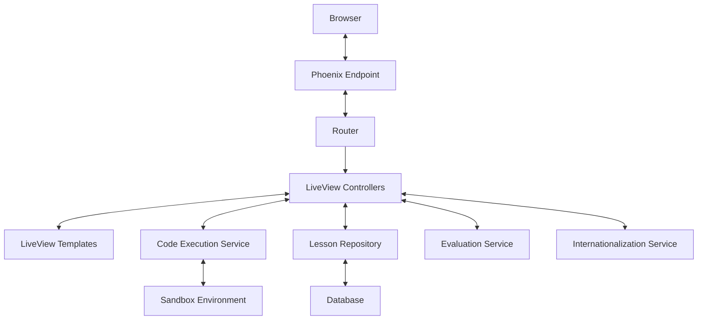

# Design Document: Interactive Elixir Lessons

## Overview

The Interactive Elixir Lessons application is a web-based platform built with Phoenix LiveView that enables users to learn Elixir and Phoenix LiveView through interactive coding exercises. The application provides a structured learning path with progressive lessons, immediate feedback on code execution, and support for both English and Japanese languages.

This design document outlines the architecture, components, data models, and implementation strategies for building the application based on the requirements.

## Architecture

The application follows a standard Phoenix LiveView architecture with some specialized components for code execution and evaluation:



### Key Components:

1. **Phoenix LiveView**: Provides the reactive UI framework for the application
2. **Code Execution Service**: Handles safe execution of user-submitted Elixir code
3. **Sandbox Environment**: Isolates code execution to prevent security issues
4. **Lesson Repository**: Manages lesson content, progress tracking, and evaluation criteria
5. **Evaluation Service**: Evaluates user solutions against lesson criteria
6. **Internationalization Service**: Manages language switching and content localization

## Components and Interfaces

### 1. User Interface Components

#### 1.1 Layout Component
- Provides the overall application structure
- Includes language selector, navigation, and main content area
- Adapts to different screen sizes (responsive design)

#### 1.2 Lesson List Component
- Displays available lessons organized by category and difficulty
- Shows completion status for each lesson
- Provides filtering and search capabilities

#### 1.3 Lesson View Component
- Displays lesson content, instructions, and examples
- Includes code editor with syntax highlighting
- Shows execution results and feedback
- Provides navigation between lessons

#### 1.4 Code Editor Component
- Monaco Editor or CodeMirror integration for rich editing experience
- Syntax highlighting for Elixir
- Basic autocompletion
- Line numbers and error indicators

#### 1.5 Code Output Component
- Displays execution results or errors
- Formats output for readability
- Shows execution time and memory usage statistics

#### 1.6 Lesson Navigation Component
- Provides navigation between lessons
- Shows progress within a lesson (for multi-step lessons)
- Allows returning to lesson list

### 2. Backend Services

#### 2.1 Code Execution Service
- Interface:
  ```elixir
  @spec execute_code(String.t(), map()) :: {:ok, map()} | {:error, map()}
  ```
- Executes user-submitted code in a sandboxed environment
- Maintains session state for variables and functions
- Implements timeout mechanism to prevent infinite loops
- Sanitizes input and output to prevent security issues

#### 2.2 Lesson Repository Service
- Interface:
  ```elixir
  @spec list_lessons(map()) :: [%Lesson{}]
  @spec get_lesson(String.t()) :: {:ok, %Lesson{}} | {:error, :not_found}
  @spec mark_lesson_complete(String.t(), String.t()) :: :ok | {:error, term()}
  @spec get_user_progress(String.t()) :: %{completed: [String.t()], current: String.t()}
  ```
- Manages lesson content and metadata
- Tracks user progress
- Provides lesson retrieval by ID, category, or difficulty

#### 2.3 Evaluation Service
- Interface:
  ```elixir
  @spec evaluate_solution(String.t(), String.t(), map()) :: %{passed: boolean(), feedback: String.t()}
  ```
- Evaluates user solutions against lesson criteria
- Provides specific feedback on solution correctness
- Supports different evaluation strategies (output matching, function checking, etc.)

#### 2.4 Internationalization Service
- Interface:
  ```elixir
  @spec get_translations(atom(), String.t()) :: map()
  @spec set_locale(String.t()) :: :ok
  @spec get_available_locales() :: [String.t()]
  ```
- Manages translations for UI elements and lesson content
- Handles locale switching
- Provides fallback mechanisms for missing translations

## Data Models

### 1. Lesson
```elixir
defmodule ElixirLearningApp.Lessons.Lesson do
  use Ecto.Schema
  import Ecto.Changeset

  schema "lessons" do
    field :title, :string
    field :slug, :string
    field :description, :string
    field :category, :string
    field :difficulty, :integer
    field :order, :integer
    field :content, :map
    field :initial_code, :string
    field :solution_code, :string
    field :evaluation_criteria, :map
    field :next_lesson_id, :string
    field :prev_lesson_id, :string

    timestamps()
  end
end
```

### 2. UserProgress
```elixir
defmodule ElixirLearningApp.Users.UserProgress do
  use Ecto.Schema
  import Ecto.Changeset

  schema "user_progress" do
    field :user_id, :string
    field :lesson_id, :string
    field :completed, :boolean, default: false
    field :attempts, :integer, default: 0
    field :last_code, :string
    field :completed_at, :utc_datetime

    timestamps()
  end
end
```

### 3. Translation
```elixir
defmodule ElixirLearningApp.I18n.Translation do
  use Ecto.Schema
  import Ecto.Changeset

  schema "translations" do
    field :locale, :string
    field :key, :string
    field :content, :map

    timestamps()
  end
end
```

## Code Execution and Sandboxing

The application will use a secure approach to execute user-submitted Elixir code:

### Approach 1: Using Elixir's built-in Code.eval_string with restrictions

```elixir
defmodule ElixirLearningApp.CodeExecution do
  @timeout 5000  # 5 seconds timeout
  @restricted_modules [File, System, Code, Port, Process]
  
  def execute(code, bindings \\ []) do
    # Create a safe binding environment
    safe_bindings = Enum.filter(bindings, fn {k, _v} -> is_atom(k) end)
    
    # Execute in a supervised task with timeout
    task = Task.async(fn ->
      try do
        # Validate code doesn't contain restricted modules
        if contains_restricted_modules?(code) do
          {:error, "Code contains restricted modules or functions"}
        else
          {result, new_bindings} = Code.eval_string(code, safe_bindings)
          {:ok, %{result: result, bindings: new_bindings}}
        end
      rescue
        e -> {:error, %{message: Exception.message(e), type: e.__struct__}}
      catch
        kind, reason -> {:error, %{message: "#{kind}: #{inspect(reason)}"}}
      end
    end)
    
    # Wait with timeout
    case Task.yield(task, @timeout) || Task.shutdown(task) do
      {:ok, result} -> result
      nil -> {:error, %{message: "Execution timed out after #{@timeout}ms"}}
    end
  end
  
  defp contains_restricted_modules?(code) do
    # Simple check for restricted module usage
    Enum.any?(@restricted_modules, fn module ->
      String.contains?(code, "#{module}.")
    end)
  end
end
```

### Approach 2: Using a dedicated sandbox process with message passing

For better isolation, we can use a dedicated process that communicates via message passing:

```elixir
defmodule ElixirLearningApp.Sandbox do
  use GenServer
  
  def start_link(opts \\ []) do
    GenServer.start_link(__MODULE__, opts)
  end
  
  def execute(pid, code) do
    GenServer.call(pid, {:execute, code}, 10_000)
  end
  
  # GenServer callbacks
  
  def init(_opts) do
    {:ok, %{bindings: []}}
  end
  
  def handle_call({:execute, code}, _from, state) do
    try do
      # Execute code with current bindings
      {result, new_bindings} = Code.eval_string(code, state.bindings)
      {:reply, {:ok, result}, %{state | bindings: new_bindings}}
    rescue
      e -> {:reply, {:error, Exception.message(e)}, state}
    end
  end
end
```

## Lesson Evaluation

The application will support multiple evaluation strategies:

### 1. Output Matching
Compares the output of the user's code with expected output.

```elixir
defmodule ElixirLearningApp.Evaluation.OutputMatcher do
  def evaluate(result, expected) do
    if to_string(result) == to_string(expected) do
      {:pass, "Your solution produces the correct output!"}
    else
      {:fail, "Expected: #{inspect(expected)}, Got: #{inspect(result)}"}
    end
  end
end
```

### 2. Function Existence Checker
Verifies that the user has defined required functions with correct signatures.

```elixir
defmodule ElixirLearningApp.Evaluation.FunctionChecker do
  def evaluate(bindings, function_name, arity) do
    function = bindings[function_name]
    
    cond do
      is_nil(function) ->
        {:fail, "Function #{function_name}/#{arity} is not defined"}
      
      !is_function(function) ->
        {:fail, "#{function_name} is defined but is not a function"}
      
      :erlang.fun_info(function)[:arity] != arity ->
        {:fail, "Function #{function_name} has arity #{:erlang.fun_info(function)[:arity]}, expected #{arity}"}
      
      true ->
        {:pass, "Function #{function_name}/#{arity} is correctly defined"}
    end
  end
end
```

### 3. Custom Validator
Allows for complex validation logic specific to each lesson.

```elixir
defmodule ElixirLearningApp.Evaluation.CustomValidator do
  def evaluate(result, bindings, validator_function) when is_function(validator_function) do
    validator_function.(result, bindings)
  end
end
```

## Internationalization

The application will use Gettext for internationalization with some custom extensions for lesson content:

```elixir
defmodule ElixirLearningApp.I18n do
  @supported_locales ["en", "ja"]
  
  def get_supported_locales, do: @supported_locales
  
  def set_locale(conn, locale) when locale in @supported_locales do
    Gettext.put_locale(ElixirLearningAppWeb.Gettext, locale)
    conn |> Plug.Conn.put_session(:locale, locale)
  end
  
  def set_locale(conn, _locale), do: conn
  
  def get_lesson_content(lesson_id, locale) do
    case ElixirLearningApp.Lessons.get_translation(lesson_id, locale) do
      nil -> ElixirLearningApp.Lessons.get_translation(lesson_id, "en") # Fallback to English
      translation -> translation
    end
  end
end
```

## User Interface Design

The UI will be designed with a clean, modern aesthetic that emphasizes readability and usability:

### Main Layout
- Fixed header with language selector and navigation
- Sidebar for lesson navigation (collapsible on smaller screens)
- Main content area for lesson content and code editor
- Responsive design that adapts to different screen sizes

### Lesson View
- Split view with instructions on the left and code editor on the right
- Resizable split pane to adjust the ratio between instructions and editor
- Code output panel below the editor
- Action buttons for running code, submitting solutions, and navigating lessons

### Code Editor
- Syntax highlighting for Elixir
- Line numbers
- Error indicators
- Auto-indentation
- Basic autocompletion

## Error Handling

The application will implement comprehensive error handling:

### Code Execution Errors
- Friendly error messages with line numbers and suggestions
- Timeout handling for infinite loops
- Memory limit enforcement

### System Errors
- Graceful degradation for backend service failures
- Automatic retry mechanisms where appropriate
- User-friendly error messages

### Data Validation
- Input validation for all user-submitted data
- Proper error messages for validation failures

## Testing Strategy

The application will be tested at multiple levels:

### Unit Tests
- Test individual components and services
- Mock external dependencies
- Focus on edge cases and error handling

### Integration Tests
- Test interactions between components
- Verify data flow through the system
- Test database interactions

### End-to-End Tests
- Simulate user interactions with the application
- Verify complete user flows
- Test internationalization

### Performance Tests
- Verify application performance under load
- Test code execution with varying complexity
- Ensure responsive UI even during intensive operations

## Security Considerations

The application will implement several security measures:

### Code Execution Sandboxing
- Restrict access to sensitive modules and functions
- Implement timeouts to prevent resource exhaustion
- Isolate execution environments between users

### Input Validation
- Validate and sanitize all user inputs
- Prevent code injection attacks
- Implement rate limiting for code execution

### Output Sanitization
- Sanitize code execution output to prevent XSS attacks
- Limit output size to prevent DoS attacks

## Implementation Plan

The implementation will be divided into several phases:

### Phase 1: Core Infrastructure
- Set up Phoenix LiveView project
- Implement basic layout and navigation
- Create database schema and migrations
- Implement internationalization framework

### Phase 2: Code Execution Engine
- Implement code execution service
- Set up sandboxing and security measures
- Create code editor component
- Implement output display

### Phase 3: Lesson System
- Implement lesson repository
- Create lesson data model
- Implement lesson navigation
- Create initial set of lessons

### Phase 4: Evaluation System
- Implement evaluation service
- Create evaluation strategies
- Implement feedback mechanism
- Connect evaluation to lesson progression

### Phase 5: User Experience Enhancements
- Improve code editor features
- Implement progress tracking
- Add visual feedback and rewards
- Optimize performance

## Deployment Considerations

The application will be deployed with the following considerations:

### Resource Requirements
- Sufficient CPU and memory for concurrent code execution
- Database for storing lesson content and user progress
- CDN for static assets

### Scaling Strategy
- Horizontal scaling for web servers
- Separate services for code execution to isolate resource usage
- Database sharding for large user bases

### Monitoring
- Performance monitoring for code execution
- Error tracking and alerting
- User activity analytics

## Conclusion

This design document outlines the architecture, components, and implementation strategy for the Interactive Elixir Lessons application. The design focuses on providing a secure, responsive, and engaging learning experience for users while ensuring maintainability and scalability of the codebase.

The application leverages Phoenix LiveView's real-time capabilities to provide immediate feedback on code execution and evaluation, creating an interactive learning environment that helps users master Elixir and Phoenix LiveView concepts effectively.